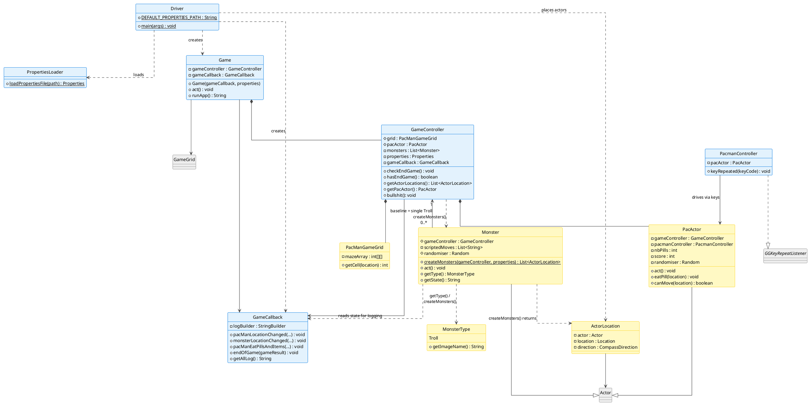

```plantuml
@startuml
!theme plain
top to bottom direction
hide circle

skinparam linetype ortho
skinparam nodesep 90
skinparam ranksep 80

/'
    Don't touch the above settings - if you wanna change something post it on discord first so we can all see 

    Take a look at the syntax at planttext.com

    Happy coding
'/

/'
Formatting to show role distintions'/
skinparam class {
    BackgroundColor White
    ArrowColor #444444
    BorderColor #333333
}

skinparam class<<Controller>> {
    BackgroundColor #E3F2FD
    BorderColor #1E88E5
}

skinparam class<<Entity>> {
    BackgroundColor #FFF9C4
    BorderColor #FDD835
}

skinparam class<<Framework>> {
    BackgroundColor #EEEEEE
    BorderColor #9E9E9E
}

'hide tagging for formatting - after show tags for labelling
hide stereotype
show <<interface>> stereotype

class Driver <<Controller>> {
    +{static} DEFAULT_PROPERTIES_PATH : String
    +{static} main(args) : void
}

class PropertiesLoader <<Controller>> {
    +{static} loadPropertiesFile(path) : Properties
}

class Game <<Controller>> {
    -gameController : GameController
    -gameCallback : GameCallback
    +Game(gameCallback, properties)
    +act() : void
    +runApp() : String
}

class GameGrid <<JGameGrid>><<Framework>>

class GameCallback <<Controller>> {
    -logBuilder : StringBuilder
    +pacManLocationChanged(...) : void
    +monsterLocationChanged(...) : void
    +pacManEatPillsAndItems(...) : void
    +endOfGame(gameResult) : void
    +getAllLog() : String
}

class GameController <<Controller>> {
    #grid : PacManGameGrid
    #pacActor : PacActor
    -monsters : List<Monster>
    -properties : Properties
    -gameCallback : GameCallback
    +checkEndGame() : void
    +hasEndGame() : boolean
    +getActorLocations() : List<ActorLocation>
    +getPacActor() : PacActor
    +bullshit(): void
}

class PacManGameGrid <<Entity>> {
    -mazeArray : int[][]
    +getCell(location) : int
}

class PacActor <<Entity>> {
    -gameController : GameController
    -pacmanController : PacmanController
    -nbPills : int
    -score : int
    -randomiser : Random
    +act() : void
    +eatPill(location) : void
    +canMove(location) : boolean
}

class PacmanController <<Controller>> {
    -pacActor : PacActor
    +keyRepeated(keyCode) : void
}

interface GGKeyRepeatListener <<Framework>>

class Monster <<Entity>> {
    #gameController : GameController
    -scriptedMoves : List<String>
    #randomiser : Random
    +{static} createMonsters(gameController, properties) : List<ActorLocation>
    +act() : void
    +getType() : MonsterType
    +getState() : String
}

enum MonsterType <<Entity>> {
    Troll
    +getImageName() : String
}

class ActorLocation <<Entity>> {
    -actor : Actor
    -location : Location
    -direction : CompassDirection
}

class Actor <<Framework>>

' Relationships
Driver ..> Game : creates
Driver ..> PropertiesLoader : loads
Driver ..> GameCallback : creates
Driver ..> ActorLocation : places actors

Game --> GameGrid
Game --> GameCallback
Game *-- GameController

GameController --> GameCallback
GameController *-- PacManGameGrid
GameController *-- PacActor
GameController "1" <-- "0..*" Monster : baseline = single Troll
GameController ..> Monster : createMonsters()

PacmanController --> PacActor : drives via keys
PacmanController ..|> GGKeyRepeatListener

PacActor --|> Actor
Monster --|> Actor

Monster ..> MonsterType : getType() /\ncreateMonsters()
Monster ..> GameCallback : reads state for logging
Monster ..> ActorLocation : createMonsters() returns

ActorLocation --> Actor
@enduml
```