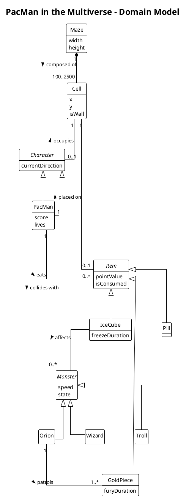

```plantuml
@startuml
skinparam style strictuml
hide empty methods
!theme plain
top to bottom direction

skinparam linetype ortho
skinparam nodesep 80
skinparam ranksep 80

title PacMan in the Multiverse - Domain Model

/'
Leaving player and game out to start lmk if you disagree and why

'/


class Maze {
  width
  height
}

class Cell {
  x
  y
  isWall
}

abstract class Character {
  currentDirection
}

class PacMan {
  score
  lives
}

abstract class Monster {
  speed
  state
}

class Troll {
}

class Orion {
}

class Wizard {
}

abstract class Item {
  pointValue
  isConsumed
}

class Pill {
}

class GoldPiece {
  furyDuration
}

class IceCube {
  freezeDuration
}

' Domain Associations
/'
Game "1" -- "1" Maze : played on >
Game "1" -- "1" PacMan : tracks >
Game "1" -- "1..*" Monster : contains >
removed game for now

TODO: find a way to make pacman line to game more clear without reordering
'/

Maze "1" *-- "100..2500" Cell : composed of >

Cell "1" -- "0..1" Character : occupies <
Cell "1" -- "0..1" Item : placed on <

' Generalisations
Character <|-- PacMan
Character <|-- Monster

Monster <|-- Troll
Monster <|-- Orion
Monster <|-- Wizard

Item <|-- Pill
Item <|-- GoldPiece
Item <|-- IceCube


IceCube -- Monster : affects >

' Interactions
PacMan "1" -- "0..*" Item : eats >
PacMan "1" -- "0..*" Monster : collides with >
Orion "1" -- "1..*" GoldPiece : patrols >

@enduml
```